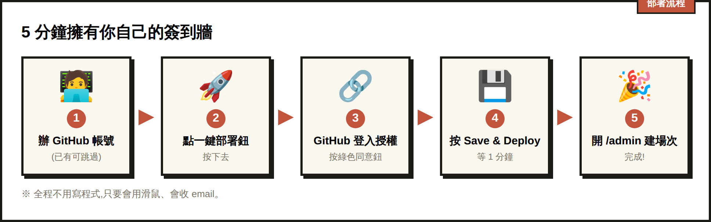
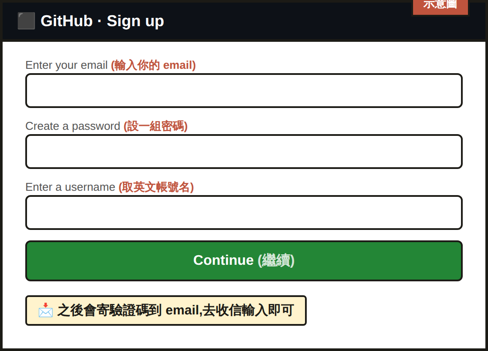
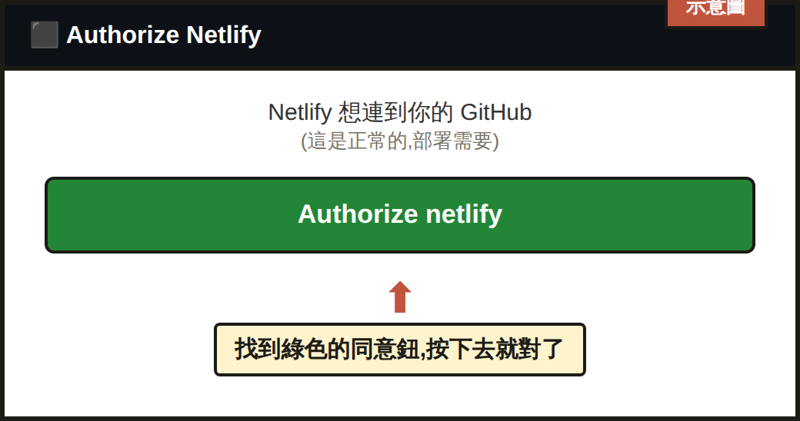
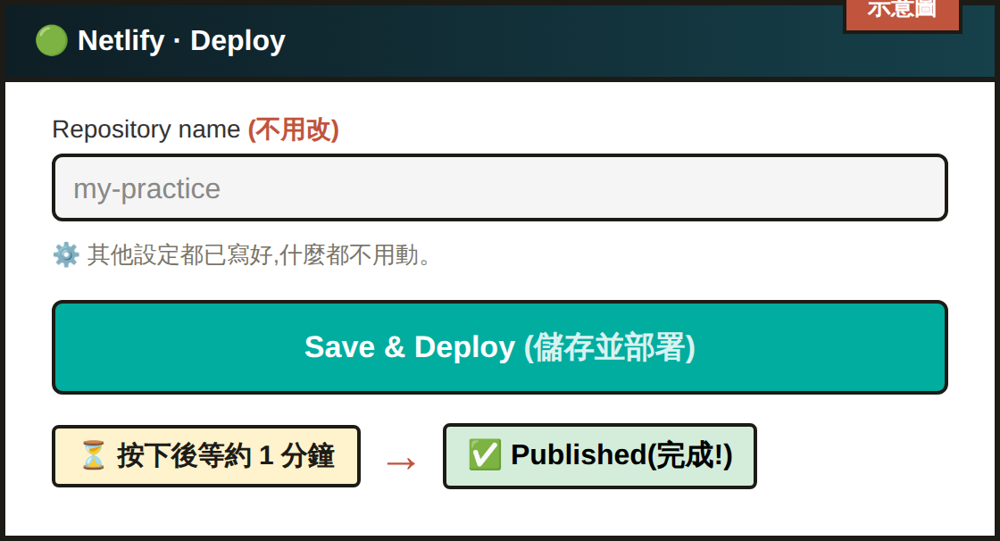

# 🚀 講師部署教學：5 分鐘擁有你自己的簽到牆

> 給「沒寫過程式、沒部署過網站」的講師看的圖文教學。
> **全程不用碰程式碼**,只要會用滑鼠、會收 email 就能完成。
> 預計時間:已有帳號約 5 分鐘;要新辦帳號約 10–15 分鐘。

完成後你會擁有:**一個你自己的簽到牆網站**(自己的網址、自己的資料、可換成自己的名字與頭像),跟別人完全獨立、互不干擾。

---

## 📋 開始前你需要
- 一台電腦 + 瀏覽器(Chrome / Edge / Safari 都可)
- 一個 email
- 兩個**免費**帳號:**GitHub** 和 **Netlify**(下面會帶你辦,不用先準備)
- 免費額度對上課綽綽有餘,**不用信用卡、不用付費**

---

## 整體流程(只有 5 大步)

1. 辦 GitHub 帳號(已有可跳過)
2. 點「一鍵部署」按鈕
3. 用 GitHub 登入 Netlify 並授權
4. 按綠色按鈕部署,等 1 分鐘
5. 打開你的網址 → 進後台建場次 🎉

---

## STEP 1️⃣ 辦一個 GitHub 帳號(已經有的話跳到 Step 2)

GitHub 是放程式碼的地方,部署需要用它登入。

1. 打開 👉 **https://github.com/signup**
2. 依畫面輸入:
   - **Enter your email**(輸入你的 email)
   - **Create a password**(設一組密碼)
   - **Enter a username**(取一個英文帳號名,例如 `summer-lab`)
3. 它會寄一封驗證信到你的 email → 去收信、輸入信裡的驗證碼。
4. 看到你的 GitHub 首頁就完成了。

> 💡 英文畫面看不懂時:`Continue` = 繼續、`Create account` = 建立帳號、`Verify` = 驗證。

---

## STEP 2️⃣ 點「一鍵部署」按鈕

點下面這顆按鈕(或連結):

👉 https://app.netlify.com/start/deploy?repository=https://github.com/Summerhuang585/my-practice

它會把你帶到 **Netlify**(放網站的地方)。

---

## STEP 3️⃣ 用 GitHub 登入 Netlify 並授權

1. 第一次會要你登入 Netlify → 選 **「Log in with GitHub」(用 GitHub 登入)**。
2. 跳出 GitHub 的授權畫面 **「Authorize Netlify」** → 按綠色的 **Authorize / Authorize netlify** 鈕(意思是「同意 Netlify 連到我的 GitHub」)。
3. 可能再出現 **「Connect to GitHub」** → 一樣按同意。

> 這幾個畫面都是英文,但你只要一直找**綠色的同意鈕**按下去就對了。

---

## STEP 4️⃣ 按綠色按鈕部署,等 1 分鐘

授權後會看到一個「部署設定」畫面:

1. 它會自動幫你在 GitHub 建一份你自己的程式副本(欄位 **Repository name** 可不用改)。
2. **不用改任何設定**(這個專案的設定檔已經寫好了)。
3. 拉到最下面,按綠色的 **「Save & Deploy」(儲存並部署)**。
4. 接著會看到一直在跑的部署進度(**Building / Deploying**)→ **等大約 1 分鐘**,出現 **「Published」** 就完成了。

---

## STEP 5️⃣ 打開你的網址 → 進後台建場次 🎉

1. 部署完成後,Netlify 會給你一個網址,長得像:
   `https://隨機名字.netlify.app`
   (在 Netlify 專案頁面最上方可以看到,可點 **Site configuration → Change site name** 改成好記的名字。)
2. 打開 **`你的網址/admin`** → 這就是你的**講師後台**。
3. 建立第一個場次 → 點該場次的 **「連結/QR」** → 把 QR 給學員掃。
4. 投影到大螢幕:開 **`你的網址/wall/場次代碼`**。

完成!這個網站完全是你的,資料也只存在你自己的帳號裡。

> **關於場次代碼**:你填 `ai-0613`,系統會給你 `ai-0613-k3f9pm`,後面六碼是它自動加的。
> 這串代碼等於看名單的鑰匙,拿到的人就看得到那一場的名字與留言(牆本來就是要投影出來的,沒辦法再上鎖)。
> 加隨機字元是為了讓別人試不出來。連結靠 QR 跟複製貼上傳,沒有人要手打,所以長一點沒關係。
> **不要把場次連結貼到公開的地方**,發給該場的參加者就好。

---

## 🎨 換成你自己的(選配,不改也能用)

### 換標題 / 名稱
場次名稱在後台建立時就能自訂,不用改程式。

### 換成你自己的頭像
1. 進你的 GitHub → 你的這個專案 → `public` 資料夾。
2. 按 **Add file → Upload files**,上傳你的頭像照片,檔名取 **`avatar.png`**(蓋掉原本的)。
3. 按 **Commit changes** → Netlify 會自動重新部署,約 1 分鐘後就換成你的頭像。

> 想要「像素風頭像」可參考主 README 的做法,或直接用一般照片也可以。

---

## ❓ 卡關排解

| 狀況 | 怎麼辦 |
|---|---|
| 找不到部署按鈕帶我去的畫面 | 確認已登入 Netlify;重新點一次本教學 Step 2 的連結 |
| 一直要我登入 GitHub | 先在另一個分頁登入 github.com,再回來點部署 |
| 網站打開但建場次就出錯 | 通常是還在部署中,等 1–2 分鐘再試;或到 Netlify 看 **Deploys** 是否 **Published** |
| 想改網址名字 | Netlify 專案頁 → **Site configuration → Change site name** |
| 覺得部署很麻煩 | 還是請你自己部署一份。參加者的名字與內容會存在「網站擁有者」那邊,用別人的站等於把你客戶的名單放到別人家。這一步只要五分鐘、不用付費。 |

---

## 需要協助?
照著做還是卡住的話,把**卡住那一步的截圖**傳給課程講師(Summer's Lab),會幫你看。
